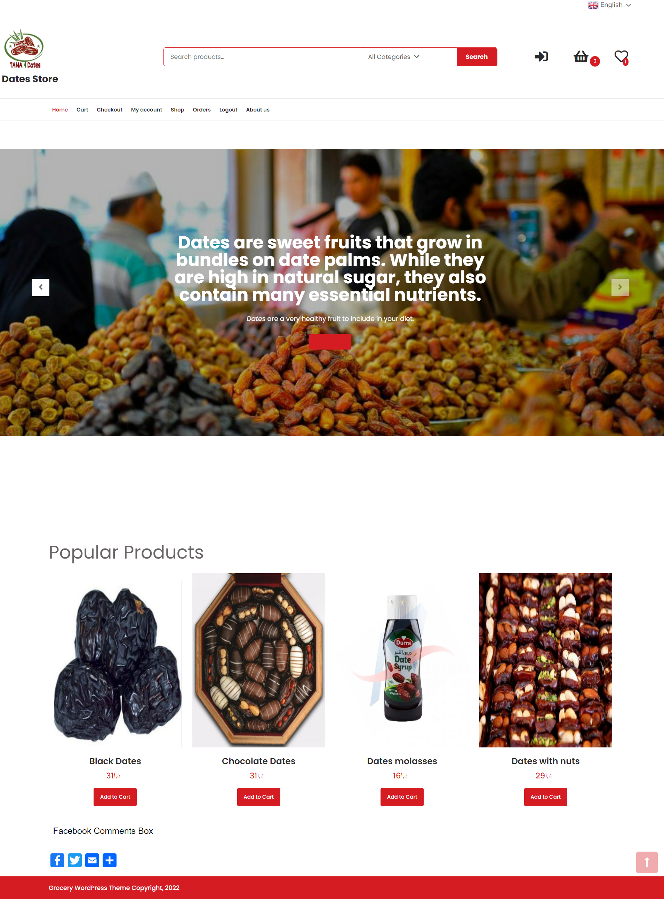

# WordPress project #3

## E-commerce website project (Dates Store)
## Done by  Tamara Al-Shabatat

After We Learn Set of Topics Like:

1. UI/Ux
2. SEO
3. CSS3
4. Wordpress
5. BOOTSTRAP
6. Git
7. Pedagogie active

----------------
### I'm DO IT!

Create my Dates-store WebSite.

## Project Overview

Build E-commerce website using WordPress The user can add product to carts , make payment, make comment , rating product  and add items to Wishlist, and the user also can search for the products and add get discount coupon.

----------------

## Important Links

1. Project Folder
   * [Repo link ](https://github.com/tamara126enad/wp_project)

2. GitHub
   * [github](https://github.com/tamara126enad)

3. Trello Board
   * [trello](https://trello.com/invite/b/YelT10s7/d613808d5b77f68fde2b8d6ffa7f6a01/wp-project)

